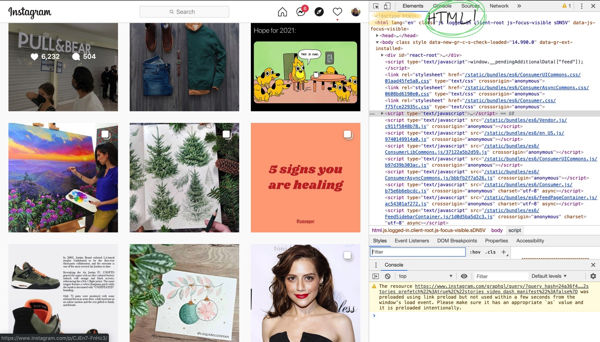
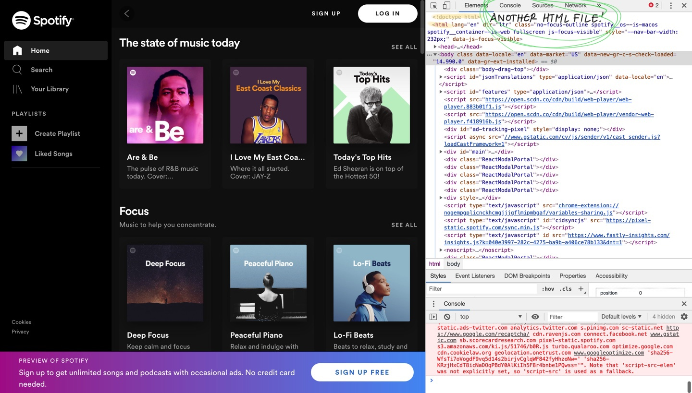
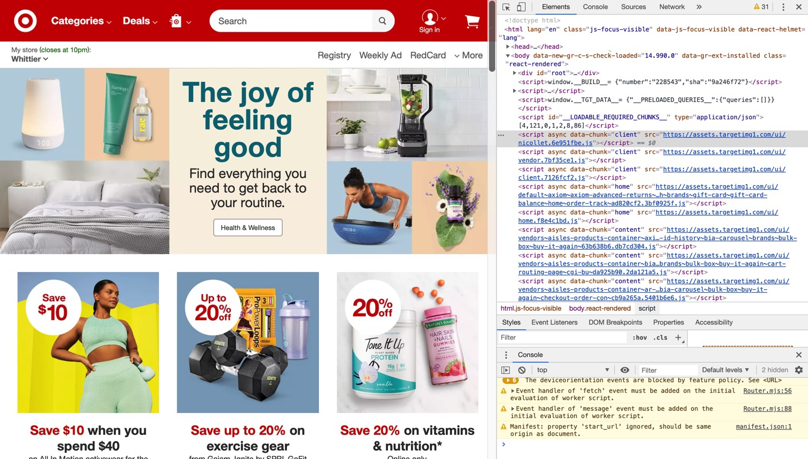
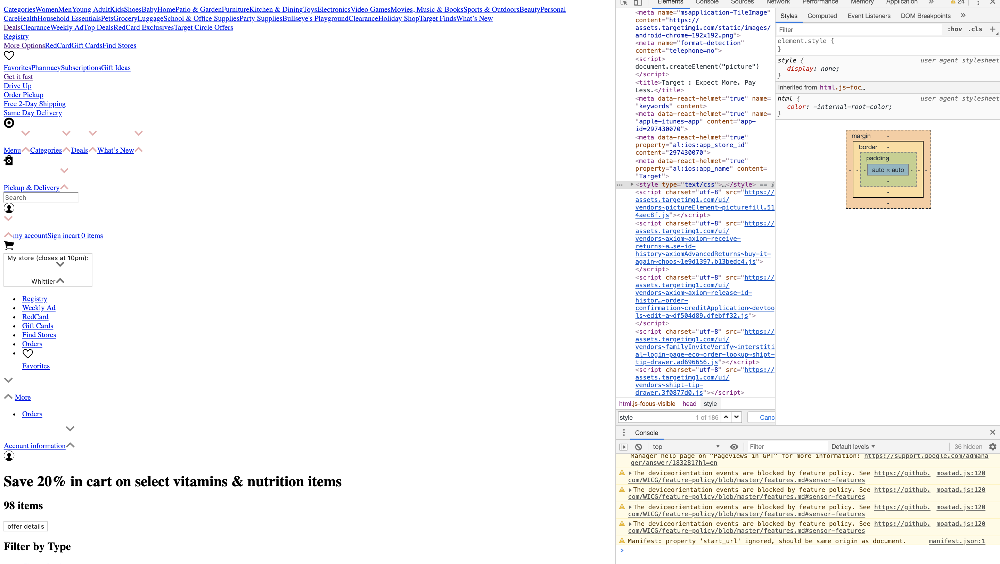

# HTML

## Defining HTML

HTML \(Hypertext Markup Language\) is used to structure the content within a website. This is useful when creating websites because it not only makes it possible to display content such as text, images, videos, links, and so on, but it also helps keep everything organized and sectioned off. 

## Briefly Defining CSS\*

CSS \(Cascading Style Sheets\) is used to make the website look beautiful. Before implementing the CSS, a website looks more like a chunk of information. Coders \(you\) use CSS to take that chunk of information and display it in a way that helps the user \(people viewing your website\) digest the material effortlessly by making the website more visually appealing. 

\*You will learn more about CSS in tomorrow's lesson!


A well-written HTML file that is neatly organized will make styling the website with CSS much easier and more enjoyable.


## Real-World Examples

To give you a better idea of times you may have experienced HTML, I've provided some examples.





These platforms use HTML to deliver content to their users. However, it is important to note that while HTML is a very powerful tool, CSS is styling the page. Here is an example of what I mean:

**With HTML and CSS:**



**With HTML but without CSS:** 



The Target site still has all of its functionality and displays all of the required information, however, the website is no longer condensed, images are not formatted, and fonts are not set. What other differences do you notice?


## Coding in HTML

In this section, we will go over the fundamentals of HTML.

### Formatting HTML Document

This is the general format of an HTML document:

```markup
<!DOCTYPE html>
<html lang="en">
<head>
  <meta charset="UTF-8">
  <meta name="viewport" content="width=device-width, initial-scale=1.0">
  <meta http-equiv="X-UA-Compatible" content="ie=edge">
  <title>Document</title>
</head>
<body>
  
</body>
</html>
```

**&lt;!DOCTYPE html&gt;** In order to tell your computer that you will be coding in HTML, you need to add this declaration to the top of the document. 

**&lt;html&gt;** indicates where the HTML code is being placed.

**&lt;head&gt;** represents the head of the code. Typically, the only elements that go in here are the title and style links.

**&lt;title&gt;** is where you put the title of your website. This is what will display on the tab of the web browser. 

**&lt;body&gt;** is where most of the code will go including all of the website's content.


repl.it does this part for you when you create your HTML file, so no need to memorize or copy any of this!


### Tags

Tags are used to tell the computer what kind of content the coder \(you\) is wanting to display. Here are some examples of tags in HTML:

```markup
<p>This is the paragraph tag! You can use this for displaying text!</p>
<h1>This is a heading tag! You can use this to display text as headers!</h1>
<h2>Also a heading tag! </h2>
<h3>Another heading tag! Heading tags go all the way up to h6!</h3>
<div>This is a div tag! You can use this to section off information! </div>
<br> ^ This is a break tag! You can use it to make a break in text!
<!-- This is a comment tag! You can use it to help other coders navigate through your code or to set reminders for yourself! -->


```


Notice how each tag \(except for break\) has an opening tag \(ex. &lt;p&gt;\) and a closing tag \(ex. &lt;/p&gt;\). This is the common structure for most but not all HTML tags!


 [You can find more HTML Tags here!](https://www.w3schools.com/tags/default.asp)

### Tags, but with _Attributes_

Some tags call for extra information in order to be entirely useful. This extra information is provided in what is called an **attribute**. 

Every attribute has a **name** and a **value**. Here is an example using an anchor tag, which is used for links:

```markup
<a href="www.youtube.com"> Click here to go to Youtube! </a>
```

In this example, "href" is the attribute name, and "www.youtube.com" is the attribute value!

### &lt;img&gt; Tag

The image tag is especially unique because it can take on many different attributes at a time, and it does not contain a closing tag. For a simple example of the different ways you can implement images into your websites, check out this [link](https://www.w3schools.com/tags/tag_img.asp)!

## All Done!

And with that information, you're all set to get exploring on your own! 

